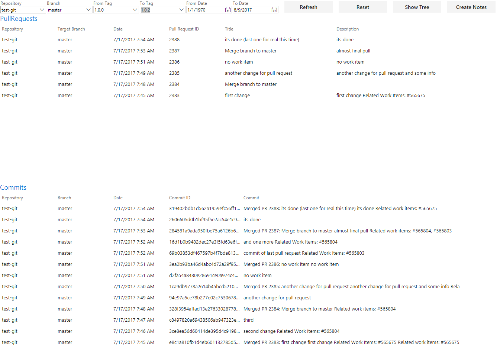
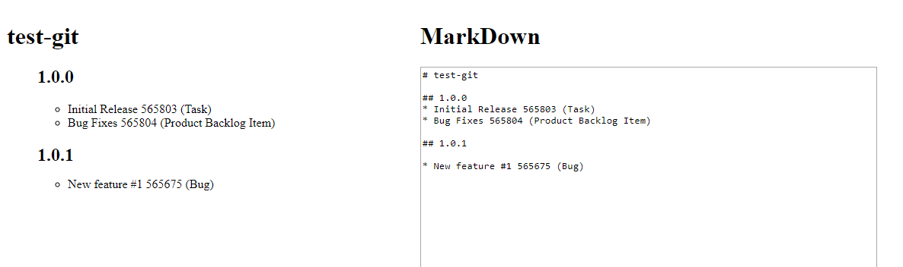

# ReleaseNoteGenerator

Create Mark down and plain text release notes.
Browse git pull requests and commits, with the option to filter between dates or/and tags.

To enjoy this tool to the fullest tags must be used.
This extension finds workitems which are linked to pullrequest and presents them between chosen tags.

In addition its possible to create a tree view which shows the hierarchy and links for pullreqeusts and workitems.   

[Link to Marketplace.](https://marketplace.visualstudio.com/items?itemName=IntelTIM.ReleaseNoteGenerator)

# Change Log
* 1.0.0 Initial Release 
